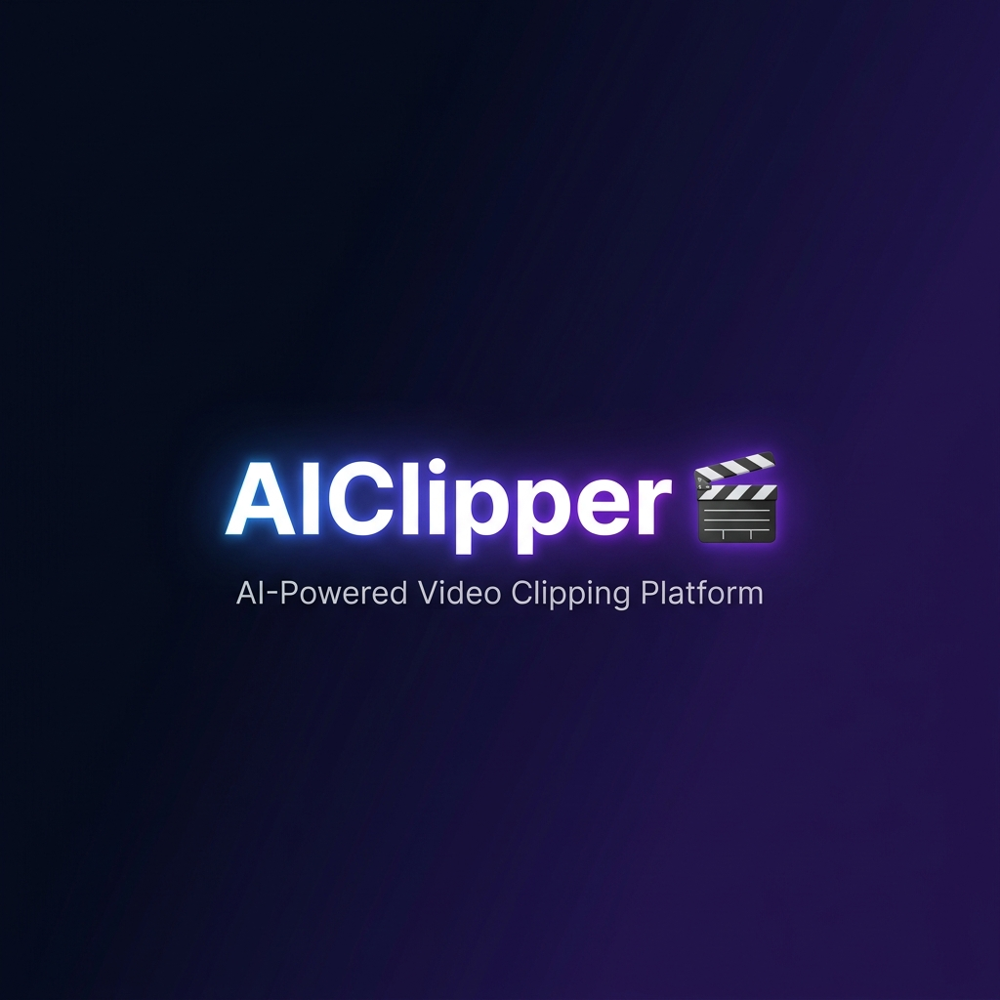

<div align="center">



<h1 align="center">AIClipper 🎬</h1>

<p align="center">
  <a href="https://github.com/MrhNabil/AIClipper/stargazers"></a>
  <a href="https://github.com/MrhNabil/AIClipper/issues"></a>
  <a href="https://github.com/MrhNabil/AIClipper/network/members"></a>
  <a href="https://github.com/MrhNabil/AIClipper/blob/main/LICENSE"></a>
</p>

<p align="center">
  
  
  
  
  
</p>

<br>

**Upload a long-form video → AI automatically finds the best moments → Generates vertical short clips with subtitles → Publishes to YouTube Shorts, Facebook Reels, and more.**

<br>

### 🖥️ Web Dashboard


<sub><em>Premium dark-mode dashboard with glassmorphism design, drag-and-drop upload, real-time processing progress, and clip management.</em></sub>

</div>

---

## ✨ Features

- [x] **Complete pipeline architecture** — clearly structured, modular code, easy to maintain
- [x] Supports both **Web UI** and **REST API** interfaces
- [x] **AI-powered clip selection** — automatically identifies the most engaging moments using multi-signal scoring
- [x] Supports various **high-definition video** sizes
  - [x] Portrait 9:16, `1080x1920` (YouTube Shorts, TikTok, Reels)
  - [x] Landscape 16:9, `1920x1080` (standard video)
- [x] **Batch video generation** — create multiple clips at once, select the best
- [x] Configurable **clip durations** (15s, 30s, 60s, custom)
- [x] **Speech-to-text transcription** with word-level timestamps via Whisper.cpp
- [x] **Smart subtitles** — SRT, VTT, and burned-in captions with word-level color highlighting
- [x] **AI scene detection** — automatic scene boundary detection via PySceneDetect
- [x] **Audio analysis** — detects laughter, crowd reactions, and emotional speech
- [x] **Face tracking** — MediaPipe-based face detection with auto-reframing for vertical crops
- [x] **AI metadata generation** — titles, descriptions, hashtags via local LLM
- [x] **Auto thumbnails** — best-frame selection using sharpness and face visibility scoring
- [x] **Background music** support with adjustable volume mixing
- [x] **Social media upload** — YouTube Shorts and Facebook Reels via official APIs
- [x] Supports multiple **LLM providers**: **Ollama**, **OpenAI**, **Google Gemini**, **DeepSeek**, and more
- [x] **100% local processing** — no cloud dependency, your data stays on your machine
- [x] **CPU-only** — no GPU required (runs on any machine with 8GB+ RAM)
- [x] **One-click startup** — `start.bat` (Windows) or `start.sh` (Linux/macOS)
- [x] **Docker ready** — one-command deployment via `docker-compose`

---

## 🎥 How It Works

```
📹 Input Video
    │
    ├─► 🗣️ Transcription (Whisper.cpp)
    ├─► 🎬 Scene Detection (PySceneDetect)
    ├─► 🎵 Audio Analysis (librosa)
    ├─► 👤 Face Tracking (MediaPipe)
    │
    ▼
🎯 AI Clip Scoring Engine
    │   (weighted multi-signal algorithm)
    │
    ├─► ✂️ Clip Generation (FFmpeg)
    ├─► 📝 Subtitle Generation (SRT/VTT/ASS)
    ├─► 🤖 AI Metadata (Ollama / OpenAI / Gemini)
    ├─► 🖼️ Thumbnail Generation
    │
    ▼
📱 Output: Vertical Short Clips (1080×1920)
    │
    └─► 🚀 Publish to YouTube / Facebook / TikTok
```

---

## 📦 System Requirements

| Item | Minimum | Recommended | Optimal |
|------|---------|-------------|---------|
| **CPU** | 4 cores | 6-8 cores | 8+ cores |
| **RAM** | 8 GB | 16 GB | 32+ GB |
| **GPU** | Not required | Not required | Not required |
| **Disk** | 5 GB | 10 GB | 20+ GB |
| **OS** | Win 10+ / macOS 11+ / Ubuntu 20+ | Any modern OS | Any modern OS |

> **Note:** GPU is never required. All AI processing runs on CPU. Processing time depends on video length and CPU power — a 10-minute video typically takes 5-15 minutes to process fully on a modern 8-core CPU.

---

## 🚀 Quick Start

### Windows (One-Click)

```bash
# Clone the repository
git clone https://github.com/MrhNabil/AIClipper.git
cd AIClipper

# Double-click start.bat or run:
start.bat
```

This will automatically:
1. ✅ Create a Python virtual environment
2. ✅ Install all dependencies
3. ✅ Download AI models (Whisper + MediaPipe)
4. ✅ Start the web server + task worker

Then open **http://localhost:8000** in your browser.

### Linux / macOS

```bash
git clone https://github.com/MrhNabil/AIClipper.git
cd AIClipper
chmod +x start.sh
./start.sh
```

### Docker

```bash
git clone https://github.com/MrhNabil/AIClipper.git
cd AIClipper/docker
docker-compose up -d

# (Optional) Pull Ollama model for AI metadata
docker exec aiclipper-ollama ollama pull qwen2
```

---

## 🛠️ Manual Installation

### Prerequisites

- **Python 3.12** (required — MediaPipe doesn't support 3.13+)
- **FFmpeg** ([download](https://ffmpeg.org/download.html)) — must be in PATH
- **Ollama** (optional) ([download](https://ollama.com)) — for AI-generated titles/descriptions

### Steps

```bash
# 1. Clone
git clone https://github.com/MrhNabil/AIClipper.git
cd AIClipper

# 2. Create virtual environment
python -m venv .venv

# Windows:
.venv\Scripts\activate
# Linux/macOS:
source .venv/bin/activate

# 3. Install dependencies
pip install -e ".[dev]"

# 4. Download AI models
python -m backend.utils.download_models

# 5. Configure
cp .env.example .env  # Edit .env as needed

# 6. Start (two terminals)
# Terminal 1: Web server
uvicorn backend.api.app:app --reload --port 8000

# Terminal 2: Task queue worker
python -m backend.workers.consumer
```

Open **http://localhost:8000** 🎉

---

## ⚙️ Configuration

All settings can be configured via `.env` file, `configs/default.yaml`, or the Web UI Settings page.

| Setting | Default | Description |
|---------|---------|-------------|
| `WHISPER_MODEL` | `small.en` | Whisper model: `tiny.en`, `base.en`, `small.en`, `medium.en` |
| `OLLAMA_MODEL` | `qwen2` | LLM model for metadata: `qwen2`, `llama3`, `gemma2` |
| `CLIP_DURATIONS` | `15,30,60` | Target clip lengths in seconds |
| `MAX_CLIPS_PER_VIDEO` | `10` | Maximum clips to generate per video |
| `OUTPUT_RESOLUTION` | `1080x1920` | Output video resolution |
| `SUBTITLE_FONT` | `Arial` | Subtitle font family |
| `SUBTITLE_FONT_SIZE` | `24` | Subtitle font size |
| `SCORING_WEIGHT_EMOTION` | `0.25` | Emotional content weight |
| `SCORING_WEIGHT_DIALOGUE` | `0.20` | Dialogue density weight |
| `SCORING_WEIGHT_SCENE` | `0.20` | Scene transition weight |
| `SCORING_WEIGHT_AUDIO` | `0.20` | Audio energy weight |
| `SCORING_WEIGHT_FACE` | `0.15` | Face visibility weight |

---

## 📡 API Documentation

Interactive API documentation is available at **http://localhost:8000/docs** (Swagger UI).

### Key Endpoints

| Method | Endpoint | Description |
|--------|----------|-------------|
| `POST` | `/api/upload` | Upload a video file |
| `POST` | `/api/process/{id}` | Start AI processing pipeline |
| `GET` | `/api/status/{id}` | Get processing progress |
| `GET` | `/api/clips` | List generated clips |
| `GET` | `/api/clips/{id}` | Get clip details |
| `DELETE` | `/api/clips/{id}` | Delete a clip |
| `POST` | `/api/publish` | Publish clip to platform |
| `GET` | `/api/analytics` | Dashboard statistics |
| `WS` | `/api/ws/progress/{id}` | Real-time progress WebSocket |

---

## 🏗️ Project Structure

```
AIClipper/
├── backend/
│   ├── api/              # FastAPI routes, schemas, app factory
│   │   ├── app.py        # Application factory + CORS + static mounts
│   │   ├── schemas.py    # 18+ Pydantic v2 request/response schemas
│   │   └── routes/       # Video, processing, clip, publishing, settings
│   ├── services/         # AI processing pipeline (11 service modules)
│   │   ├── transcription.py     # Whisper.cpp speech recognition
│   │   ├── scene_detection.py   # PySceneDetect scene boundaries
│   │   ├── audio_analysis.py    # librosa audio energy + emotion
│   │   ├── face_tracking.py     # MediaPipe face detection + cropping
│   │   ├── clip_scoring.py      # Multi-signal scoring engine
│   │   ├── clip_generator.py    # FFmpeg vertical clip generation
│   │   ├── subtitles.py         # SRT/VTT/ASS subtitle generation
│   │   ├── metadata_generator.py # LLM-powered metadata
│   │   ├── thumbnail_generator.py # Best-frame thumbnail selection
│   │   ├── pipeline.py          # Full pipeline orchestrator
│   │   └── uploaders/           # YouTube, Facebook upload modules
│   ├── database/         # SQLAlchemy models, CRUD, migrations
│   ├── workers/          # Huey task queue (SQLite backend)
│   └── utils/            # Config, logging, FFmpeg, validators
├── frontend/             # Web UI (vanilla HTML/CSS/JS)
│   ├── index.html        # SPA shell
│   ├── css/styles.css    # 54KB premium dark-mode design system
│   └── js/               # API client, components, SPA router
├── configs/              # YAML configuration files
├── docker/               # Dockerfile + docker-compose.yml
├── tests/                # pytest test suite
├── docs/                 # Documentation
├── start.bat             # One-click Windows launcher
├── start.sh              # One-click Linux/macOS launcher
├── pyproject.toml        # Python project configuration
└── README.md             # This file
```

---

## 🤖 Supported AI Models

### Speech Recognition (Whisper.cpp)
| Model | Size | Speed | Accuracy | RAM Usage |
|-------|------|-------|----------|-----------|
| `tiny.en` | 75 MB | ⚡⚡⚡ Fastest | ⭐⭐ | ~1 GB |
| `base.en` | 142 MB | ⚡⚡ Fast | ⭐⭐⭐ | ~2 GB |
| `small.en` | 466 MB | ⚡ Moderate | ⭐⭐⭐⭐ | ~4 GB |
| `medium.en` | 1.5 GB | 🐢 Slow | ⭐⭐⭐⭐⭐ | ~8 GB |

### Metadata Generation (LLM)
| Provider | Models | Local | API Key |
|----------|--------|-------|---------|
| **Ollama** | Qwen 2, Llama 3, Gemma 2 | ✅ Yes | ❌ No |
| **OpenAI** | GPT-4o, GPT-4o-mini | ❌ No | ✅ Yes |
| **Google** | Gemini Pro, Gemini Flash | ❌ No | ✅ Yes |
| **DeepSeek** | DeepSeek V3 | ❌ No | ✅ Yes |

---

## 🧪 Testing

```bash
# Run all tests
pytest

# With coverage report
pytest --cov=backend --cov-report=html

# Run specific test module
pytest tests/test_api/test_videos.py -v
pytest tests/test_services/test_clip_scoring.py -v
```

---

## 🐳 Docker Deployment

```bash
cd docker
docker-compose up -d
```

Services:
| Service | Port | Description |
|---------|------|-------------|
| `aiclipper-app` | 8000 | Web UI + API |
| `aiclipper-worker` | — | Background task processor |
| `ollama` | 11434 | Local LLM (optional) |

---

## 📋 Roadmap

- [ ] TikTok upload integration
- [ ] Instagram Reels upload integration
- [ ] Batch video processing queue
- [ ] Custom prompt templates for metadata
- [ ] Video preview before processing
- [ ] Export presets (e.g., "TikTok Optimized", "YouTube Shorts HD")
- [ ] Multi-language subtitle support
- [ ] Voice clone / TTS narration overlay
- [ ] Watermark overlay support
- [ ] A/B test clip thumbnails

---

## 🤝 Contributing

Contributions are welcome! Please:

1. Fork the repository
2. Create a feature branch (`git checkout -b feature/amazing-feature`)
3. Commit your changes (`git commit -m 'Add amazing feature'`)
4. Push to the branch (`git push origin feature/amazing-feature`)
5. Open a Pull Request

---

## ⚖️ Legal Notice

This software processes **user-owned content only**. It does **NOT** include any features that attempt to remove, bypass, evade, defeat, or disguise copyright ownership, DRM, watermark protection, content identification systems, or platform copyright enforcement mechanisms.

---

## 📄 License

This project is licensed under the MIT License — see the [LICENSE](LICENSE) file for details.

---

<div align="center">

**If you find this project useful, please consider giving it a ⭐!**

Made with ❤️ and I

</div>
